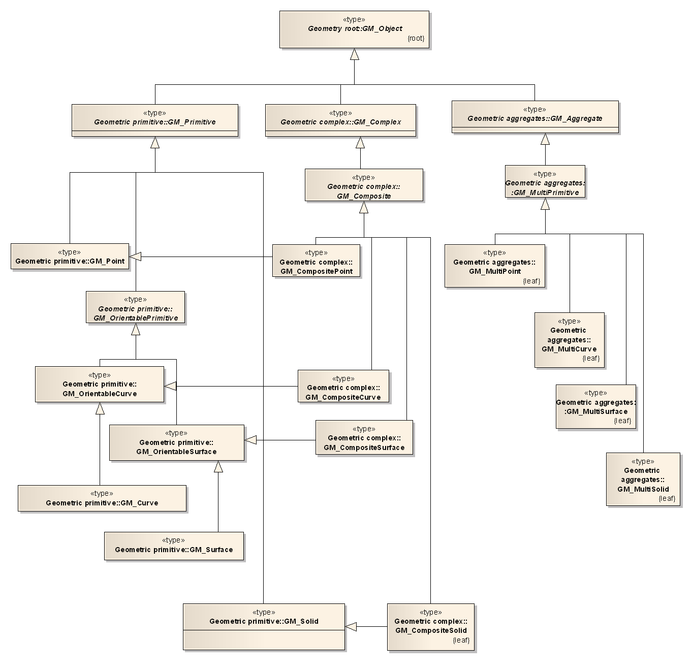
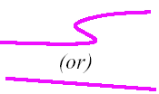
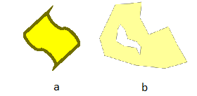
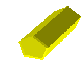
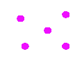

# Geometrie in model

Dit hoofdstuk beschrijft de definitie van de geometrietypen zoals die zijn gedefinieerd in ISO 19107: Geographic information -- Spatial schema [[iso-19107-2003]] en in informatiemodellen worden toegepast. Alleen het geometrie gedeelte van het ruimtelijke schema is in deze handreiking opgenomen; het topologie gedeelte wordt niet besproken.

## Ruimtelijk schema van ISO 19107
NEN 3610 beschrijft de regels voor het modelleren van geo-informatie. Belangrijk in de definitie van een geografisch object is dat het locatie eigenschappen heeft. Eén van die locatie eigenschappen is de directe locatie die middels coördinaten is beschreven. Door middel van attributen wordt de directe locatie en geometrie door coördinaten gerepresenteerd. De waarden van die attributen zijn coördinaten of coördinaatreeksen die een geometrie representeren. We noemen dit geometrietypen. In ISO 19107 is een klassediagram, het ruimtelijk schema, opgenomen met de geometrietypen en hun onderlinge relaties. De geometrietypen uit dit diagram worden gebruikt om de geometrietypen in geo-informatiemodellen te specificeren.

Voor de geometrietypen zijn er verschillende niveau´s van complexiteit van structuur en dimensionaliteit. Voor de complexiteit van structuur is er een verdeling in de geometrisch primitieven punt, lijn, vlak en volume en de geometrische complexen. Complexen hebben een complexe datastructuur en zijn opgebouwd uit een verzameling geometrische primitieven.

- Geometrische primitieven
- Geometrische complexen

Dimensionaliteit is het tweede criterium bij het definiëren van geometrietypen.

- 0 dimensies
- 1 dimensie
- 2 dimensies
- 3 dimensies

Het ISO 19107 ruimtelijk schema is geconstrueerd rond die twee criteria van data complexiteit en dimensionaliteit. Er is nog een derde criterium, functionaliteit (operaties), dat echter voor de indeling van de geometrietypen in het ruimtelijk schema geen gevolgen heeft. ISO 19125-1 Simple feature access [[iso-19125-1-2004]] definieert een model voor 2 dimensionale geometrietypen. Zie hiervoor ook het OGC origineel <a href="http://www.opengeospatial.org/standards/sfa">OpenGIS® Implementation Standard for Geographic information - Simple feature access - Part 1: Common architecture</a>. In dit 2D geometriemodel zijn restricties opgenomen die van een algemene geometrie een simpele geometrie maken. De term simple feature staat daarin voor features beperkt tot 2 dimensionale geometrie.

Figuur 1 beeldt het ruimtelijk schema af en is overgenomen uit het INSPIRE
consolidated UML model. Dat is weer gebaseerd op het model voor geometrische
basistypen uit de ISO 19107.

<figure>
    
    <figcaption>Ruimtelijk schema van ISO 19107</figcaption>
</figure>

Uit dit schema worden alleen de geometrietypen toegelicht die voor deze handreiking van toepassing zijn. De toelichting is beperkt en omvat alleen de informatie die voor de toepassing van dit document relevant is. Voor de volledige beschrijving wordt verwezen naar ISO 19107. Voor simple features (2D) gelden er restricties die apart worden aangegeven.

### GM_Object

De superklasse van alle geometrietypen. Deze klasse beschrijft de eigenschappen die alle geometrie types in ISO 19107 delen. Operaties die voor de klasse GM_Object beschreven zijn zullen dus voor ieder geometrietype geïmplementeerd zijn. Als in een model de geometrie van een object beschreven moet worden terwijl er niets bekend is over het mogelijke voorkomen van die geometrie dan kan GM_Object worden gekozen.

Ook als een klasse meerdere geometrietypen toestaat (bijvoorbeeld: een inrichtingselement kan een punt of een lijn zijn) kan GM_Object worden gebruikt, waarbij dit met een constraint wordt ingeperkt tot GM_Point en GM_Curve.

## Geometrische primitieven

### GM_Point

Punt. 0-dimensionale geometrie.

### GM_Curve

Lijn. 1-dimensionale geometrie.

Een curve is simple indien er geen zelfintersectie optreedt.

<figure>
    
    <figcaption>Lijngeometrie</figcaption>
</figure>

Lijnen zijn continu en hebben een meetbare lengte in een coördinaten systeem. Lijnen bestaan uit een of meer lijnsegmenten waarbij de lijnsegmenten verschillende interpolatiemethoden kunnen gebruiken. Lijnsegmenten zijn aan elkaar verbonden waarbij het eindpunt van elk segment, behalve de laatste, verbonden is aan het beginpunt van het volgende. Wanneer het begin- en eindpunt van een lijn met elkaar verbonden zijn is de lijn gesloten en spreken we ook wel van een Ring.

### GM_Surface

Vlak. 2-dimensionale geometrie.

<figure>
    
    <figcaption>Vlakgeometrie (a) en vlakgeometrie met binnengrens (b)</figcaption>
</figure>

Een vlak heeft een oriëntatie, dat wil zeggen, een boven en onderzijde. De bovenzijde is gedefinieerd als de kant vanaf welke de begrenzing tegen de klok in (anti clock wise) is gedigitaliseerd. Een vlak bestaat uit een of meer ‘surface patches’. Indien er meerdere zijn dan vormen die samen een aaneengesloten vlak.

Een vlak is simple indien een vlak bestaat uit één surface patch.

Een vlak heeft normaal gesproken in ieder geval in 2D situaties een buitenkant, de exterior. Daarnaast kan een vlak ook nog 0 of meer interne begrenzingen hebben, de interior. De buitenkant heeft, zoals hierboven beschreven, van bovenaf gezien een richting tegen de klok in. De binnenkant wordt met de klok mee vastgelegd.

### GM_Solid

Volume. 3-dimensionaal geometrietype.

<figure>
    
    <figcaption>Volume geometrie</figcaption>
</figure>

De geometrie van een GM_Solid is opgebouwd uit GM_SolidBoundaries (grenzen) die elk weer een GM_Surface zijn. Deze zijn naar buiten toe georiënteerd: de bovenkant van elk vlak is aan de buitenkant van het volume object te zien.

### Interpolatie

Lijnen zijn opgebouwd uit lijnsegmenten. Lijnsegmenten kunnen verschillende interpolatiemethoden voor de interpretatie van de coördinaten hebben. In de regel worden in Nederland (zie Nederlands profiel) alleen de lineaire en ‘circular arc by three points’ gebruikt.

De volgende interpolatiemethoden zijn gespecificeerd. In de lijst hieronder zijn de Engelse ISO 19107 termen weergegeven. Alleen de meest gebruikte typen worden uitgelegd.

- Linear: rechte lijn tussen twee opeenvolgende punten
- Geodesic
- Circular arc by three points: elke set van drie punten vormt een cirkelvormige boog (arc) die begint bij het eerste punt, door het tweede punt gaat en eindigt bij het derde punt. Als de drie punten op één lijn liggen ontstaat er een rechte lijn.
- Circular arc by two points
- Circular arc by two points and bulge factor
- Elliptical arc
- Clothoid
- Conic arc
- Polynominal spline
- Cubic spline
- Rational spline

## Geometrische aggregaties

Het is mogelijk om samenstellingen van geometrietypen te aggregeren in nieuwe geometrie typen. Hiervoor is het aggregatiepakket ontwikkeld. Aggregaties hebben verder geen regels over de inhoudelijke structuur; in algemeenheid zijn er geen
regels over of de geometrische primitieven elkaar moeten/mogen raken, overlappen enzovoort. Voor simple features (2D) gelden er wel restricties. Deze worden apart aangegeven.

Geometrische complexen oftewel composites zijn ook samenstellingen van geometrische primitieven, maar hierbij gelden wel aanvullende regels. Deze composites worden verder niet besproken. Ze zijn geen onderdeel van het Simple Features profile (zie ).

### GM_MultiPoint

Multipunt. Verzameling van punten die gezamenlijk één object vormen. (instanties van GM_Point). Een multipoint is simple indien er geen punten met dezelfde coördinaten voorkomen.

<figure>
    
    <figcaption>Multipunt geometrie</figcaption>
</figure>

### GM_MultiCurve

Multilijn. Verzameling van lijnen die gezamenlijk één object vormen (instanties van GM_Curve).

Een multicurve is simple indien de samenstellende delen simple zijn en de enige intersecties tussen delen zich bevinden in punten aan de buitenkant van die objecten (geen kruising wel vertakking).

<figure>
    
    <figcaption>Multilijn geometrie</figcaption>
</figure>

### GM_MultiSurface

Multivlak. Verzameling van vlakken die gezamenlijk één object vormen (instanties van GM_Surface).

Vlakken in een multisurface mogen elkaar niet overlappen. In een simple multisurface mogen vlakken elkaar alleen raken in een eindig aantal punten (wel punten maar geen grenzen gemeenschappelijk)

<figure>
    
    <figcaption>Multivlak geometrie</figcaption>
</figure>

### GM_MultiSolid
Multivolume. Verzameling van volumes die gezamenlijk één object vormen (instanties van GM_Solid).

<figure>
    
    <figcaption>Multivolume geometrie</figcaption>
</figure>

## Definities van 2, 2.5 en 3D

Voor het representeren van geometrieën is de dimensionaliteit van groot belang. Voor 2 en 3 dimensionale representatie lijkt voor de hand te liggen wat daar mee bedoeld wordt. In de praktijk wordt er ook nog over 2.5 D gesproken. Het is daarom goed om bruikbare definities te hanteren.

2D: Objecten bestaan uit punten, lijnen of vlakken. Coördinaten zijn een x en een y-waarde.

2,5D: Punten, lijnen of vlakken. Coördinaten zijn een x,y en z waarde. Bij elk x,y-locatie is er maximaal één z-waarde beschikbaar. Dat betekent dat 2D geometrien zich in een 3D ruimte (x,y,z) bevinden maar dat de geometrien zichzelf of elkaar niet mogen overlappen in de horizontale projectie.

3D: Volume eenheden oftewel ‘solids’ zijn onderdeel van de mogelijke geometrietypen. Bij elke x,y-locatie zijn er meerdere z-waarden mogelijk.

## Nederlands profiel op ISO 19107

Het ruimtelijk schema in al zijn complexiteit is geschikt om zeer gevarieerde representaties van geometrieën te definiëren. Bij het kiezen van geometrietypen ter implementatie in een softwareomgeving is het van belang eisen ten aanzien van interoperabiliteit mee te nemen. In het kader van het Nederlands profiel op ISO 19107 is er gekeken naar GML als implementatieomgeving. Daarin is geëvalueerd welke subset van geometrietypen uit het ruimtelijke schema tot een basisset, een profiel, moeten behoren. Er is daarmee een directe link tussen het Nederlandse profiel op GML en het profiel op ISO 19107.
