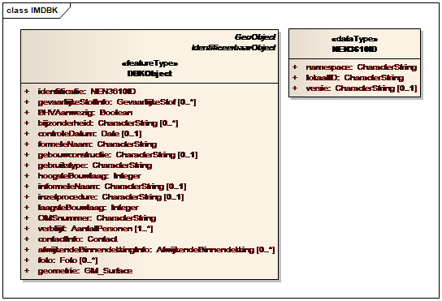
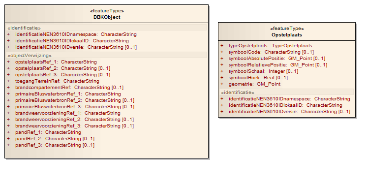

# Basisregels voor transformatie van een SF2 naar een SF0 model.

SF2 is de standaard voor informatiemodellen in Nederland. Toch is het in sommige gevallen gewenst om te werken met een eenvoudiger informatiemodel, dat met name voor software die de complexere zaken in SF2 niet ondersteunt, te begrijpen is.

## Inleiding

De beperkingen die SF0 oplegt aan de GML structuur op het gebied van datastructurering en datatypen maken dit niveau het meest verwant aan een gangbare databasestructuur. Dit kan bijvoorbeeld het importeren van een GML bestand of het serveren van GML data in een web service sterk vereenvoudigen.

Als het voor een implementatie nodig is dat de GML bestanden aan SF0 voldoen in plaats van het in Nederland algemeen geldende SF2, kan er naast het conceptuele informatiemodel, dat voldoet aan SF2, een afgeleide versie worden gemaakt die
voldoet aan SF0. Dit brengt een aantal wijzigingen in het informatiemodel met zich mee, die in dit hoofdstuk besproken worden.

De in dit hoofdstuk opgenomen voorbeelden zijn fictief en hebben geen relatie met een actueel model.

## Verschil SF0 en SF2

Wie een informatiemodel moet omzetten dat voldoet aan SF2 naar een variant die voldoet aan het strengere SF0, moet met de volgende aspecten rekening houden:

- Van de XML Schema typen mogen alleen `string`, `integer`, `date`, `real`, `binary`, `boolean`, en `URI` gebruikt worden, plus het GML type `measurement`.
- Eigen, eenvoudige of samengestelde datatypen zijn niet toegestaan.
- Eigenschappen mogen geen meervoudige kardinaliteit hebben.
- Verwijzingen moeten met `gml:ReferenceType` worden vastgelegd.
- XML Schema `nillable` functionaliteit mag niet gebruikt worden.

## Normalisatieregels

Om een informatiemodel volgens SF0 te implementeren op basis van een SF2 informatiemodel kunnen de volgende normalisatieregels gevolgd worden.

### Meervoudig attribuut

In SF2 is het toegestaan om attributen (eigenschappen van features) meerdere keren te laten voorkomen. In SF0 mag elk attribuut maar één keer voorkomen.

Er zijn twee oplossingen waaruit gekozen kan worden:
1. Beperk het aantal toegestane voorkomens van het attribuut tot één, en neem indien er meerdere waarden aanwezig zijn, deze op in het attribuut, met een scheidingsteken (bijvoorbeeld ‘;’) tussen elke twee waarden. Het voordeel hiervan is dat men onbeperkt waarden kan opnemen. Het nadeel is dat er geen enumeratie of ander datatype anders dan een (alfanumerieke) string kan worden toegekend aan het attribuut. Ook is er extra moeite nodig om eventueel de individuele waarden weer uit te lezen.
2. Neem voor het attribuut zoveel voorkomens op als redelijkerwijs nodig is. Als een attribuut bijvoorbeeld in de praktijk niet meer dan 3 keer voorkomt, kan men hiervoor drie attributen opnemen in het informatiemodel (bijvoorbeeld: naam1, naam2 en naam3). De attributen moeten altijd beginnen met dezelfde inhoudelijke naam en eindigen met een cijferaanduiding.

### Zelfgemaakte datatypen

Complexe datatypen, oftewel samengestelde attributen, met eigen geneste structuur, zijn in SF2 wel toegestaan, maar in SF0 niet.

<figure>
  
  <figcaption>Klasse met zelfgemaakt, complex datatype ‘identificatie’ in SF2 model</figcaption>
</figure>

Samengestelde attributen worden in een aan SF0 voldoend informatiemodel opgenomen als losse attributen. Met een gelijknamig stereotype dat bij elk van de attributen die bij het samengestelde attribuut horen wordt opgenomen, wordt in het UML informatiemodel aangegeven dat de attributen bij elkaar horen. Het stereotype wordt in de UML klasse weergegeven boven de attributen die het gemeenschappelijk hebben tussen << >>.

Daarnaast krijgen deze attributen een gemeenschappelijke prefix, die aangeeft dat ze een groep vormen. Zo zijn ze in een GML bestand ook te herkennen als bij elkaar horende groep.

<figure>
    
    <figcaption>Klasse met samengesteld attribuut in SF0 model</figcaption>
</figure>

### Associaties

<figure>
    
    <figcaption>Associatie in een SF2 UML model</figcaption>
</figure>

Ook associaties zijn in een SF2 informatiemodel wel toegestaan, maar in een SF0 model niet. Associaties worden in een GML bestand gecodeerd als ofwel een geneste structuur, ofwel een link. In SF0 zijn geneste structuren niet toegestaan (zie de vorige paragraaf) en mogelijk links/verwijzingen alleen worden uitgedrukt met behulp van het `gml:ReferenceType`.

Om het zo eenvoudig mogelijk te houden geldt voor de vertaling van associaties uit een SF2 model naar een SF0 model dat deze in plaats van als associaties tussen klassen in het model worden opgenomen als attributen:

- met het stereotype `<<objectVerwijzing>>`,
- en met een suffix `Ref`.

Als de associatie meerdere keren mag voorkomen, wordt dit op de zelfde manier opgelost als bij meervoudige attributen.

In het attribuut wordt de identificatie opgenomen van het object waarnaar
verwezen wordt.

<figure>
    
    <figcaption>Klasse in SF0 model met objectVerwijzingen</figcaption>
</figure>
