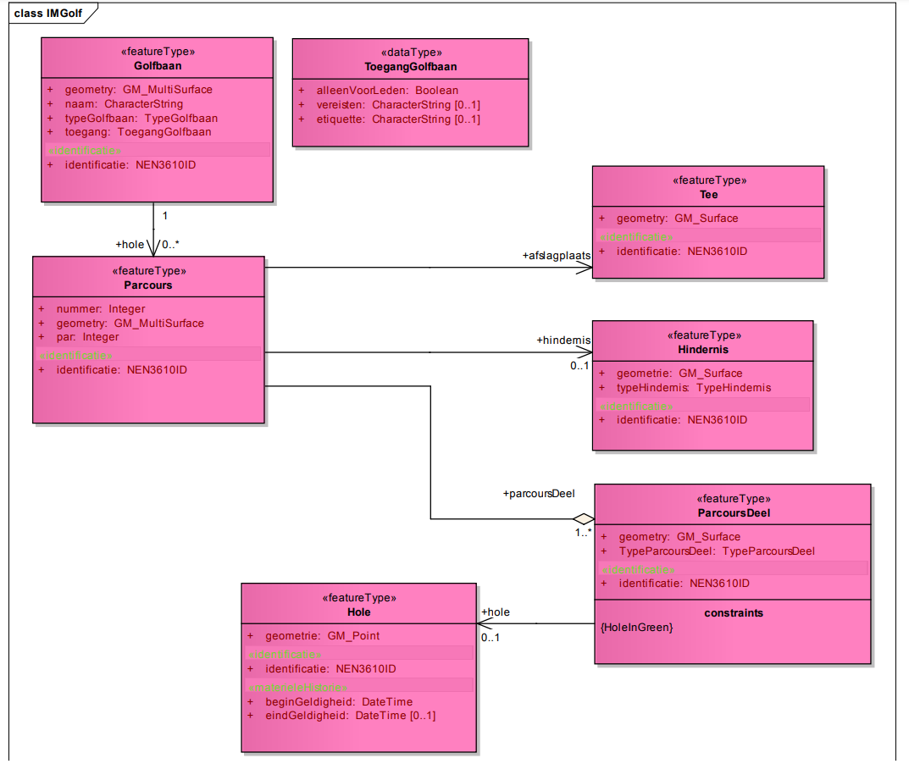

# Uitgewerkt voorbeeld
In deze bijlage wordt aan de hand van een eenvoudig model de relatie tussen een UML een
daarvan afgeleid XML Schema en een concreet GML document weergegeven.

## IMGolf model in UML

<figure>
    
    <figcaption>IMGolf klassediagram</figcaption>
</figure>

<figure>
    
    <figcaption>Enumeraties van IM Golf model</figcaption>
</figure>

## IMGolf Feature Catalogus

<aside class="issue">Feature Catalogus nog opnemen.</aside>

## IMGolf XML applicatie schema
<aside class="issue">Hier staan XML Schema en XML instance voorbeelden maar deze worden niet goed als voorbeeld getoond.</aside>

<pre class="example">

<?xml version="1.0" encoding="UTF-8"?>
<schema xmlns="http://www.w3.org/2001/XMLSchema"
xmlns:IMGolf="http://www.geonovum.nl/IMGolf"
 xmlns:gml="http://www.opengis.net/gml/3.2"
xmlns:gmlsf="http://www.opengis.net/gmlsf/2.0"
 elementFormDefault="qualified" targetNamespace="http://www.geonovum.nl/IMGolf"
version="1.0">
 <import namespace="http://www.opengis.net/gml/3.2"
 schemaLocation="http://schemas.opengis.net/gml/3.2.1/gml.xsd"/>
 <import namespace="http://www.opengis.net/gmlsf/2.0"
 schemaLocation="http://schemas.opengis.net/gmlsfProfile/2.0/gmlsfLevels.xsd"/>
 <!--GML Applicatie Schema voor voorbeeld van NEN3610 Versie 1.0 datum 2012-02-20-->
 <annotation>
 <appinfo source="http://schemas.opengis.net/gmlsfProfile/2.0/gmlsfLevels.xsd">
 <gmlsf:ComplianceLevel>2</gmlsf:ComplianceLevel>
 </appinfo>
 </annotation>
 <element name="FeatureCollectionIMGolf" type="IMGolf:FeatureCollectionIMGolfType"
 substitutionGroup="gml:AbstractGML"/>
 <complexType name="FeatureCollectionIMGolfType">
 <complexContent>
 <extension base="gml:AbstractFeatureType">
 <sequence minOccurs="0" maxOccurs="unbounded">
 <element name="featureMember">
 <complexType>
 <complexContent>
 <extension base="gml:AbstractFeatureMemberType">
 <sequence>
 <element ref="gml:AbstractFeature"/>
 </sequence>
 </extension>
 </complexContent>
 </complexType>
 </element>
 </sequence>
 </extension>
 </complexContent>
 </complexType>
 <element name="Hole" substitutionGroup="gml:AbstractFeature" type="IMGolf:HoleType"/>
 <complexType name="HoleType">
 <complexContent>
 <extension base="gml:AbstractFeatureType">
 <sequence>
 <element name="geometrie" type="gml:PointPropertyType"/>
 <element name="identificatie" type="IMGolf:NEN3610IDPropertyType"/>
 <element name="beginGeldigheid" type="dateTime"/>
 <element minOccurs="0" name="eindGeldigheid" type="dateTime"/>
 </sequence>
 </extension>
 </complexContent>
 </complexType>
 <complexType name="HolePropertyType">
<!-- <sequence minOccurs="0">
<element ref="IMGolf:Hole"/>
 </sequence>-->
 <attributeGroup ref="gml:AssociationAttributeGroup"/>
 <attributeGroup ref="gml:OwnershipAttributeGroup"/>
 </complexType>
 <simpleType name="TypeHindernisType">
 <restriction base="string">
 <enumeration value="waterpartij"/>
 <enumeration value="bunker"/>
 </restriction>
 </simpleType>
 <element name="ToegangGolfbaan" substitutionGroup="gml:AbstractObject"
 type="IMGolf:ToegangGolfbaanType"/>
 <complexType name="ToegangGolfbaanType">
 <sequence>
 <element name="alleenVoorLeden" type="boolean"/>
 <element minOccurs="0" name="vereisten" type="string"/>
 <element minOccurs="0" name="etiquette" type="string"/>
 </sequence>
 </complexType>
 <complexType name="ToegangGolfbaanPropertyType">
 <sequence>
 <element ref="IMGolf:ToegangGolfbaan"/>
 </sequence>
 </complexType>
 <simpleType name="TypeGolfbaanType">
 <restriction base="string">
 <enumeration value="linksbaan"/>
 <enumeration value="bosbaan"/>
 <enumeration value="parkbaan"/>
 </restriction>
 </simpleType>
 <element name="Parcours" substitutionGroup="gml:AbstractFeature"
type="IMGolf:ParcoursType"/>
 <complexType name="ParcoursType">
 <complexContent>
 <extension base="gml:AbstractFeatureType">
 <sequence>
 <element name="identificatie" type="IMGolf:NEN3610IDPropertyType"/>
 <element name="nummer" type="integer"/>
 <element name="geometry" type="gml:MultiSurfacePropertyType"/>
 <element name="par" type="integer"/>
 <element maxOccurs="unbounded" minOccurs="0" name="afslagplaats"
 type="IMGolf:TeePropertyType">
 <annotation>
 <appinfo>
 <targetElement
xmlns="http://www.opengis.net/gml/3.2">IMGolf:Tee</targetElement>
 </appinfo>
 </annotation>
 </element>
 <element maxOccurs="unbounded" name="parcoursDeel"
type="IMGolf:ParcoursDeelPropertyType">
 <annotation>
 <appinfo>
 <targetElement
 xmlns="http://www.opengis.net/gml/3.2">IMGolf:ParcoursDeel</targetElement>
 </appinfo>
 </annotation>
 </element>
 <element minOccurs="0" name="hindernis" type="IMGolf:HindernisPropertyType">
 <annotation>
 <appinfo>
 <targetElement
xmlns="http://www.opengis.net/gml/3.2">IMGolf:Hindernis</targetElement>
 </appinfo>
 </annotation>
 </element>
 </sequence>
 </extension>
 </complexContent>
 </complexType>
 <complexType name="ParcoursPropertyType">
 <!--<sequence minOccurs="0">
 <element ref="IMGolf:Parcours"/>
 </sequence>-->
 <attributeGroup ref="gml:AssociationAttributeGroup"/>
 <attributeGroup ref="gml:OwnershipAttributeGroup"/>
 </complexType>
 <element name="ParcoursDeel" substitutionGroup="gml:AbstractFeature"
 type="IMGolf:ParcoursDeelType"/>
 <complexType name="ParcoursDeelType">
 <complexContent>
 <extension base="gml:AbstractFeatureType">
 <sequence>
 <element name="geometry" type="gml:SurfacePropertyType"/>
 <element name="identificatie" type="IMGolf:NEN3610IDPropertyType"/>
 <element name="TypeParcoursDeel" type="IMGolf:TypeParcoursDeelType"/>
 <element name="hole" type="IMGolf:HolePropertyType" minOccurs="0">
 <annotation>
 <appinfo>
 <targetElement
xmlns="http://www.opengis.net/gml/3.2">IMGolf:Hole</targetElement>
 </appinfo>
 </annotation>
 </element>
 </sequence>
 </extension>
 </complexContent>
 </complexType>
 <complexType name="ParcoursDeelPropertyType">
<!-- <sequence minOccurs="0">
 <element ref="IMGolf:ParcoursDeel"/>
 </sequence>-->
 <attributeGroup ref="gml:AssociationAttributeGroup"/>
 <attributeGroup ref="gml:OwnershipAttributeGroup"/>
 </complexType>
 <element name="Tee" substitutionGroup="gml:AbstractFeature" type="IMGolf:TeeType"/>
 <complexType name="TeeType">
 <complexContent>
 <extension base="gml:AbstractFeatureType">
 <sequence>
 <element name="geometry" type="gml:SurfacePropertyType"/>
 <element name="identificatie" type="IMGolf:NEN3610IDPropertyType"/>
 </sequence>
 </extension>
 </complexContent>
 </complexType>
 <complexType name="TeePropertyType">
<!-- <sequence minOccurs="0">
 <element ref="IMGolf:Tee"/>
 </sequence>-->
 <attributeGroup ref="gml:AssociationAttributeGroup"/>
 <attributeGroup ref="gml:OwnershipAttributeGroup"/>
 </complexType>
 <element name="NEN3610ID" substitutionGroup="gml:AbstractObject"
type="IMGolf:NEN3610IDType"/>
 <complexType name="NEN3610IDType">
 <sequence>
 <element name="namespace" type="string"/>
 <element name="lokaalID" type="string"/>
 <element minOccurs="0" name="versie" type="string"/>
 </sequence>
 </complexType>
 <complexType name="NEN3610IDPropertyType">
 <sequence>
 <element ref="IMGolf:NEN3610ID"/>
 </sequence>
 </complexType>
 <simpleType name="TypeParcoursDeelType">
 <restriction base="string">
 <enumeration value="fairway"/>
 <enumeration value="green"/>
 <enumeration value="rough"/>
 <enumeration value="semi-rough"/>
 </restriction>
 </simpleType>
 <element name="Hindernis" substitutionGroup="gml:AbstractFeature"
type="IMGolf:HindernisType"/>
 <complexType name="HindernisType">
 <complexContent>
 <extension base="gml:AbstractFeatureType">
 <sequence>
 <element name="geometrie" type="gml:SurfacePropertyType"/>
 <element name="identificatie" type="IMGolf:NEN3610IDPropertyType"/>
 <element name="typeHindernis" type="IMGolf:TypeHindernisType"/>
 </sequence>
 </extension>
 </complexContent>
 </complexType>
 <complexType name="HindernisPropertyType">
<!-- <sequence minOccurs="0">
 <element ref="IMGolf:Hindernis"/>
 </sequence>-->
 <attributeGroup ref="gml:AssociationAttributeGroup"/>
 <attributeGroup ref="gml:OwnershipAttributeGroup"/>
 </complexType>
 <element name="Golfbaan" substitutionGroup="gml:AbstractFeature"
 type="IMGolf:GolfbaanType"/>
 <complexType name="GolfbaanType">
 <complexContent>
 <extension base="gml:AbstractFeatureType">
 <sequence>
 <element name="geometry" type="gml:MultiSurfacePropertyType"/>
 <element name="naam" type="string"/>
 <element name="typeGolfbaan" type="IMGolf:TypeGolfbaanType"/>
 <element name="toegang" type="IMGolf:ToegangGolfbaanPropertyType"/>
 <element name="identificatie" type="IMGolf:NEN3610IDPropertyType"/>
 <element maxOccurs="unbounded" minOccurs="0" name="hole"
 type="IMGolf:ParcoursPropertyType">
 <annotation>
 <appinfo>
 <targetElement
xmlns="http://www.opengis.net/gml/3.2">IMGolf:Parcours</targetElement>
 </appinfo>
 </annotation>
 </element>
 </sequence>
 </extension>
 </complexContent>
 </complexType>
 <complexType name="GolfbaanPropertyType">
<!-- <sequence minOccurs="0">
 <element ref="IMGolf:Golfbaan"/>
 </sequence>-->
 <attributeGroup ref="gml:AssociationAttributeGroup"/>
 <attributeGroup ref="gml:OwnershipAttributeGroup"/>
 </complexType>
</schema>

</pre>

## IMGolf GML document

<pre class="example">

<?xml version="1.0" encoding="UTF-8"?>
<FeatureCollectionIMGolf xmlns:xlink="http://www.w3.org/1999/xlink"
xmlns:gml="http://www.opengis.net/gml/3.2"
xmlns="http://www.geonovum.nl/IMGolf" xmlns:xsi="http://www.w3.org/2001/XMLSchemainstance"
xsi:schemaLocation="http://www.geonovum.nl/IMGolf IMGolf.xsd" gml:id="ID001">
<gml:boundedBy>
<gml:Envelope srsDimension="2" srsName="urn:opengis:def:crs:EPSG::xxxxx">
<gml:lowerCorner>10 10</gml:lowerCorner>
<gml:upperCorner>20 20</gml:upperCorner>
</gml:Envelope>
</gml:boundedBy>
<featureMember>
<Golfbaan gml:id="G11">
<geometry>
<gml:MultiSurface gml:id="x00">
<gml:surfaceMember>
<gml:Polygon gml:id="x2">
<gml:exterior>
<gml:LinearRing>
<gml:posList>10 10 20 10 20 20 10 20 10 10</gml:posList>
</gml:LinearRing>
</gml:exterior>
</gml:Polygon>
</gml:surfaceMember>
</gml:MultiSurface>
</geometry>
<naam>Openbare golfbaan Westlaren</naam>
<typeGolfbaan>bosbaan</typeGolfbaan>
<toegang>
<ToegangGolfbaan>
<alleenVoorLeden>false</alleenVoorLeden>
</ToegangGolfbaan>
</toegang>
<identificatie>
<NEN3610ID>
<namespace>NL.IMGOLF</namespace>
<lokaalID>G1</lokaalID>
</NEN3610ID>
</identificatie>
<hole xlink:href="#Hin1v1"/>
</Golfbaan>
</featureMember>
<featureMember>
<Parcours gml:id="Hin1v1">
<identificatie>
<NEN3610ID>
<namespace>NL.IMGOLF</namespace>
<lokaalID>Hin1</lokaalID>
<versie>1</versie>
</NEN3610ID>
</identificatie>
<nummer>1</nummer>
<geometry>
<gml:MultiSurface gml:id="x01">
<gml:surfaceMember>
<gml:Polygon gml:id="x3">
<gml:exterior>
<gml:LinearRing>
<gml:posList>11 11 15 11 15 19 11 19 11 11</gml:posList>
</gml:LinearRing>
</gml:exterior>
</gml:Polygon>
</gml:surfaceMember>
</gml:MultiSurface>
</geometry>
<par>5</par>
<afslagplaats xlink:href="#t01"/>
<parcoursDeel xlink:href="#pd01"/>
<parcoursDeel xlink:href="pd02"/>
</Parcours>
</featureMember>
<featureMember>
<Tee gml:id="t01">
<geometry>
<gml:Polygon gml:id="x4">
<gml:exterior>
<gml:LinearRing>
<gml:posList>12 12 14 12 14 13 12 13 12 12</gml:posList>
</gml:LinearRing>
</gml:exterior>
</gml:Polygon>
</geometry>
<identificatie>
<NEN3610ID>
<namespace>NL.IMGOLF</namespace>
<lokaalID>t01</lokaalID>
</NEN3610ID>
</identificatie>
</Tee>
</featureMember>
<featureMember>
<ParcoursDeel gml:id="pd01">
<geometry>
<gml:Polygon gml:id="x06">
<gml:exterior>
<gml:LinearRing>
<gml:posList>12 13 14 13 14 17 12 17 12 13</gml:posList>
</gml:LinearRing>
</gml:exterior>
</gml:Polygon>
</geometry>
<identificatie>
<NEN3610ID>
<namespace>NL.IMGOLF</namespace>
<lokaalID>pd01</lokaalID>
</NEN3610ID>
</identificatie>
<TypeParcoursDeel>fairway</TypeParcoursDeel>
</ParcoursDeel>
</featureMember>
<featureMember>
<ParcoursDeel gml:id="pd02">
<geometry>
<gml:Polygon gml:id="x07">
<gml:exterior>
<gml:LinearRing>
<gml:posList>12 17 14 17 14 18.5 12 18.5 12 17</gml:posList>
</gml:LinearRing>
</gml:exterior>
</gml:Polygon>
</geometry>
<identificatie>
<NEN3610ID>
<namespace>NL.IMGOLF</namespace>
<lokaalID>pd01</lokaalID>
</NEN3610ID>
</identificatie>
<TypeParcoursDeel>green</TypeParcoursDeel>
<hole xlink:href="#h01"/>
</ParcoursDeel>
</featureMember>
<featureMember>
<Hole gml:id="h01">
<geometrie>
<gml:Point gml:id="x5">
<gml:pos>13 18</gml:pos>
</gml:Point>
</geometrie>
<identificatie>
<NEN3610ID>
<namespace>NL.IMGOLF</namespace>
<lokaalID>h01</lokaalID>
</NEN3610ID>
</identificatie>
<beginGeldigheid>2011-12-01T00:00:00</beginGeldigheid>
</Hole>
</featureMember>
</FeatureCollectionIMGolf>

</pre>