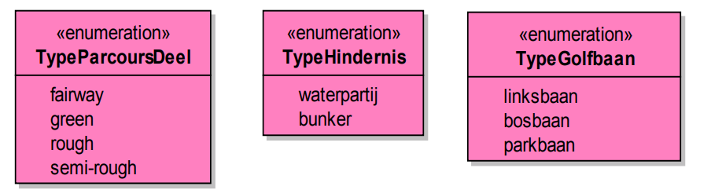

# Uitgewerkt voorbeeld
In deze bijlage wordt aan de hand van een eenvoudig model de relatie tussen een UML een
daarvan afgeleid XML Schema en een concreet GML document weergegeven.

## IMGolf model in UML

<figure>
    
    <figcaption>IMGolf klassediagram</figcaption>
</figure>

<figure>
    
    <figcaption>Enumeraties van IM Golf model</figcaption>
</figure>

## IMGolf Feature Catalogus

<aside class="issue">Feature Catalogus nog opnemen.</aside>

## IMGolf XML applicatie schema
<aside class="issue">Hier staan XML Schema en XML instance voorbeelden maar deze worden niet goed als voorbeeld getoond.</aside>

<pre class="example">
&lt;?xml version="1.0" encoding="UTF-8"?>
&lt;schema xmlns="http://www.w3.org/2001/XMLSchema"
    xmlns:IMGolf="http://www.geonovum.nl/IMGolf"
    xmlns:gml="http://www.opengis.net/gml/3.2"
    xmlns:gmlsf="http://www.opengis.net/gmlsf/2.0"
    elementFormDefault="qualified" targetNamespace="http://www.geonovum.nl/IMGolf"
    version="1.0">
    &lt;import namespace="http://www.opengis.net/gml/3.2"
        schemaLocation="http://schemas.opengis.net/gml/3.2.1/gml.xsd"/>
    &lt;import namespace="http://www.opengis.net/gmlsf/2.0"
        schemaLocation="http://schemas.opengis.net/gmlsfProfile/2.0/gmlsfLevels.xsd"/>
    &lt;!--GML Applicatie Schema voor voorbeeld van NEN3610 Versie 1.0 datum 2012-02-20-->
    &lt;annotation>
        &lt;appinfo source="http://schemas.opengis.net/gmlsfProfile/2.0/gmlsfLevels.xsd">
            &lt;gmlsf:ComplianceLevel>2&lt;/gmlsf:ComplianceLevel>
        &lt;/appinfo>
    &lt;/annotation>
    &lt;element name="FeatureCollectionIMGolf" type="IMGolf:FeatureCollectionIMGolfType"
        substitutionGroup="gml:AbstractGML"/>
    &lt;complexType name="FeatureCollectionIMGolfType">
        &lt;complexContent>
            &lt;extension base="gml:AbstractFeatureType">
                &lt;sequence minOccurs="0" maxOccurs="unbounded">
                    &lt;element name="featureMember">
                        &lt;complexType>
                            &lt;complexContent>
                                &lt;extension base="gml:AbstractFeatureMemberType">
                                    &lt;sequence>
                                        &lt;element ref="gml:AbstractFeature"/>
                                    &lt;/sequence>
                                &lt;/extension>
                            &lt;/complexContent>
                        &lt;/complexType>
                    &lt;/element>
                &lt;/sequence>
            &lt;/extension>
        &lt;/complexContent>
    &lt;/complexType>
    &lt;element name="Hole" substitutionGroup="gml:AbstractFeature" type="IMGolf:HoleType"/>
    &lt;complexType name="HoleType">
        &lt;complexContent>
            &lt;extension base="gml:AbstractFeatureType">
                &lt;sequence>
                    &lt;element name="geometrie" type="gml:PointPropertyType"/>
                    &lt;element name="identificatie" type="IMGolf:NEN3610IDPropertyType"/>
                    &lt;element name="beginGeldigheid" type="dateTime"/>
                    &lt;element minOccurs="0" name="eindGeldigheid" type="dateTime"/>
                &lt;/sequence>
            &lt;/extension>
        &lt;/complexContent>
    &lt;/complexType>
    &lt;complexType name="HolePropertyType">
        &lt;!-- &lt;sequence minOccurs="0">
&lt;element ref="IMGolf:Hole"/>
 &lt;/sequence>-->
        &lt;attributeGroup ref="gml:AssociationAttributeGroup"/>
        &lt;attributeGroup ref="gml:OwnershipAttributeGroup"/>
    &lt;/complexType>
    &lt;simpleType name="TypeHindernisType">
        &lt;restriction base="string">
            &lt;enumeration value="waterpartij"/>
            &lt;enumeration value="bunker"/>
        &lt;/restriction>
    &lt;/simpleType>
    &lt;element name="ToegangGolfbaan" substitutionGroup="gml:AbstractObject"
        type="IMGolf:ToegangGolfbaanType"/>
    &lt;complexType name="ToegangGolfbaanType">
        &lt;sequence>
            &lt;element name="alleenVoorLeden" type="boolean"/>
            &lt;element minOccurs="0" name="vereisten" type="string"/>
            &lt;element minOccurs="0" name="etiquette" type="string"/>
        &lt;/sequence>
    &lt;/complexType>
    &lt;complexType name="ToegangGolfbaanPropertyType">
        &lt;sequence>
            &lt;element ref="IMGolf:ToegangGolfbaan"/>
        &lt;/sequence>
    &lt;/complexType>
    &lt;simpleType name="TypeGolfbaanType">
        &lt;restriction base="string">
            &lt;enumeration value="linksbaan"/>
            &lt;enumeration value="bosbaan"/>
            &lt;enumeration value="parkbaan"/>
        &lt;/restriction>
    &lt;/simpleType>
    &lt;element name="Parcours" substitutionGroup="gml:AbstractFeature"
        type="IMGolf:ParcoursType"/>
    &lt;complexType name="ParcoursType">
        &lt;complexContent>
            &lt;extension base="gml:AbstractFeatureType">
                &lt;sequence>
                    &lt;element name="identificatie" type="IMGolf:NEN3610IDPropertyType"/>
                    &lt;element name="nummer" type="integer"/>
                    &lt;element name="geometry" type="gml:MultiSurfacePropertyType"/>
                    &lt;element name="par" type="integer"/>
                    &lt;element maxOccurs="unbounded" minOccurs="0" name="afslagplaats"
                        type="IMGolf:TeePropertyType">
                        &lt;annotation>
                            &lt;appinfo>
                                &lt;targetElement
                                    xmlns="http://www.opengis.net/gml/3.2">IMGolf:Tee&lt;/targetElement>
                            &lt;/appinfo>
                        &lt;/annotation>
                    &lt;/element>
                    &lt;element maxOccurs="unbounded" name="parcoursDeel"
                        type="IMGolf:ParcoursDeelPropertyType">
                        &lt;annotation>
                            &lt;appinfo>
                                &lt;targetElement
                                    xmlns="http://www.opengis.net/gml/3.2">IMGolf:ParcoursDeel&lt;/targetElement>
                            &lt;/appinfo>
                        &lt;/annotation>
                    &lt;/element>
                    &lt;element minOccurs="0" name="hindernis" type="IMGolf:HindernisPropertyType">
                        &lt;annotation>
                            &lt;appinfo>
                                &lt;targetElement
                                    xmlns="http://www.opengis.net/gml/3.2">IMGolf:Hindernis&lt;/targetElement>
                            &lt;/appinfo>
                        &lt;/annotation>
                    &lt;/element>
                &lt;/sequence>
            &lt;/extension>
        &lt;/complexContent>
    &lt;/complexType>
    &lt;complexType name="ParcoursPropertyType">
        &lt;!--&lt;sequence minOccurs="0">
 &lt;element ref="IMGolf:Parcours"/>
 &lt;/sequence>-->
        &lt;attributeGroup ref="gml:AssociationAttributeGroup"/>
        &lt;attributeGroup ref="gml:OwnershipAttributeGroup"/>
    &lt;/complexType>
    &lt;element name="ParcoursDeel" substitutionGroup="gml:AbstractFeature"
        type="IMGolf:ParcoursDeelType"/>
    &lt;complexType name="ParcoursDeelType">
        &lt;complexContent>
            &lt;extension base="gml:AbstractFeatureType">
                &lt;sequence>
                    &lt;element name="geometry" type="gml:SurfacePropertyType"/>
                    &lt;element name="identificatie" type="IMGolf:NEN3610IDPropertyType"/>
                    &lt;element name="TypeParcoursDeel" type="IMGolf:TypeParcoursDeelType"/>
                    &lt;element name="hole" type="IMGolf:HolePropertyType" minOccurs="0">
                        &lt;annotation>
                            &lt;appinfo>
                                &lt;targetElement
                                    xmlns="http://www.opengis.net/gml/3.2">IMGolf:Hole&lt;/targetElement>
                            &lt;/appinfo>
                        &lt;/annotation>
                    &lt;/element>
                &lt;/sequence>
            &lt;/extension>
        &lt;/complexContent>
    &lt;/complexType>
    &lt;complexType name="ParcoursDeelPropertyType">
        &lt;!-- &lt;sequence minOccurs="0">
 &lt;element ref="IMGolf:ParcoursDeel"/>
 &lt;/sequence>-->
        &lt;attributeGroup ref="gml:AssociationAttributeGroup"/>
        &lt;attributeGroup ref="gml:OwnershipAttributeGroup"/>
    &lt;/complexType>
    &lt;element name="Tee" substitutionGroup="gml:AbstractFeature" type="IMGolf:TeeType"/>
    &lt;complexType name="TeeType">
        &lt;complexContent>
            &lt;extension base="gml:AbstractFeatureType">
                &lt;sequence>
                    &lt;element name="geometry" type="gml:SurfacePropertyType"/>
                    &lt;element name="identificatie" type="IMGolf:NEN3610IDPropertyType"/>
                &lt;/sequence>
            &lt;/extension>
        &lt;/complexContent>
    &lt;/complexType>
    &lt;complexType name="TeePropertyType">
        &lt;!-- &lt;sequence minOccurs="0">
 &lt;element ref="IMGolf:Tee"/>
 &lt;/sequence>-->
        &lt;attributeGroup ref="gml:AssociationAttributeGroup"/>
        &lt;attributeGroup ref="gml:OwnershipAttributeGroup"/>
    &lt;/complexType>
    &lt;element name="NEN3610ID" substitutionGroup="gml:AbstractObject"
        type="IMGolf:NEN3610IDType"/>
    &lt;complexType name="NEN3610IDType">
        &lt;sequence>
            &lt;element name="namespace" type="string"/>
            &lt;element name="lokaalID" type="string"/>
            &lt;element minOccurs="0" name="versie" type="string"/>
        &lt;/sequence>
    &lt;/complexType>
    &lt;complexType name="NEN3610IDPropertyType">
        &lt;sequence>
            &lt;element ref="IMGolf:NEN3610ID"/>
        &lt;/sequence>
    &lt;/complexType>
    &lt;simpleType name="TypeParcoursDeelType">
        &lt;restriction base="string">
            &lt;enumeration value="fairway"/>
            &lt;enumeration value="green"/>
            &lt;enumeration value="rough"/>
            &lt;enumeration value="semi-rough"/>
        &lt;/restriction>
    &lt;/simpleType>
    &lt;element name="Hindernis" substitutionGroup="gml:AbstractFeature"
        type="IMGolf:HindernisType"/>
    &lt;complexType name="HindernisType">
        &lt;complexContent>
            &lt;extension base="gml:AbstractFeatureType">
                &lt;sequence>
                    &lt;element name="geometrie" type="gml:SurfacePropertyType"/>
                    &lt;element name="identificatie" type="IMGolf:NEN3610IDPropertyType"/>
                    &lt;element name="typeHindernis" type="IMGolf:TypeHindernisType"/>
                &lt;/sequence>
            &lt;/extension>
        &lt;/complexContent>
    &lt;/complexType>
    &lt;complexType name="HindernisPropertyType">
        &lt;!-- &lt;sequence minOccurs="0">
 &lt;element ref="IMGolf:Hindernis"/>
 &lt;/sequence>-->
        &lt;attributeGroup ref="gml:AssociationAttributeGroup"/>
        &lt;attributeGroup ref="gml:OwnershipAttributeGroup"/>
    &lt;/complexType>
    &lt;element name="Golfbaan" substitutionGroup="gml:AbstractFeature"
        type="IMGolf:GolfbaanType"/>
    &lt;complexType name="GolfbaanType">
        &lt;complexContent>
            &lt;extension base="gml:AbstractFeatureType">
                &lt;sequence>
                    &lt;element name="geometry" type="gml:MultiSurfacePropertyType"/>
                    &lt;element name="naam" type="string"/>
                    &lt;element name="typeGolfbaan" type="IMGolf:TypeGolfbaanType"/>
                    &lt;element name="toegang" type="IMGolf:ToegangGolfbaanPropertyType"/>
                    &lt;element name="identificatie" type="IMGolf:NEN3610IDPropertyType"/>
                    &lt;element maxOccurs="unbounded" minOccurs="0" name="hole"
                        type="IMGolf:ParcoursPropertyType">
                        &lt;annotation>
                            &lt;appinfo>
                                &lt;targetElement
                                    xmlns="http://www.opengis.net/gml/3.2">IMGolf:Parcours&lt;/targetElement>
                            &lt;/appinfo>
                        &lt;/annotation>
                    &lt;/element>
                &lt;/sequence>
            &lt;/extension>
        &lt;/complexContent>
    &lt;/complexType>
    &lt;complexType name="GolfbaanPropertyType">
        &lt;attributeGroup ref="gml:AssociationAttributeGroup"/>
        &lt;attributeGroup ref="gml:OwnershipAttributeGroup"/>
        &lt;sequence minOccurs="0">
         &lt;element ref="IMGolf:Golfbaan"/>
        &lt;/sequence>
    &lt;/complexType>
&lt;/schema>

</pre>

## IMGolf GML document

<pre class="example">

&lt;?xml version="1.0" encoding="UTF-8"?>
&lt;FeatureCollectionIMGolf xmlns:xlink="http://www.w3.org/1999/xlink"
    xmlns:gml="http://www.opengis.net/gml/3.2"
    xmlns="http://www.geonovum.nl/IMGolf" xmlns:xsi="http://www.w3.org/2001/XMLSchemainstance"
    xsi:schemaLocation="http://www.geonovum.nl/IMGolf IMGolf.xsd" gml:id="ID001">
    &lt;gml:boundedBy>
        &lt;gml:Envelope srsDimension="2" srsName="urn:opengis:def:crs:EPSG::xxxxx">
            &lt;gml:lowerCorner>10 10&lt;/gml:lowerCorner>
            &lt;gml:upperCorner>20 20&lt;/gml:upperCorner>
        &lt;/gml:Envelope>
    &lt;/gml:boundedBy>
    &lt;featureMember>
        &lt;Golfbaan gml:id="G11">
            &lt;geometry>
                &lt;gml:MultiSurface gml:id="x00">
                    &lt;gml:surfaceMember>
                        &lt;gml:Polygon gml:id="x2">
                            &lt;gml:exterior>
                                &lt;gml:LinearRing>
                                    &lt;gml:posList>10 10 20 10 20 20 10 20 10 10&lt;/gml:posList>
                                &lt;/gml:LinearRing>
                            &lt;/gml:exterior>
                        &lt;/gml:Polygon>
                    &lt;/gml:surfaceMember>
                &lt;/gml:MultiSurface>
            &lt;/geometry>
            &lt;naam>Openbare golfbaan Westlaren&lt;/naam>
            &lt;typeGolfbaan>bosbaan&lt;/typeGolfbaan>
            &lt;toegang>
                &lt;ToegangGolfbaan>
                    &lt;alleenVoorLeden>false&lt;/alleenVoorLeden>
                &lt;/ToegangGolfbaan>
            &lt;/toegang>
            &lt;identificatie>
                &lt;NEN3610ID>
                    &lt;namespace>NL.IMGOLF&lt;/namespace>
                    &lt;lokaalID>G1&lt;/lokaalID>
                &lt;/NEN3610ID>
            &lt;/identificatie>
            &lt;hole xlink:href="#Hin1v1"/>
        &lt;/Golfbaan>
    &lt;/featureMember>
    &lt;featureMember>
        &lt;Parcours gml:id="Hin1v1">
            &lt;identificatie>
                &lt;NEN3610ID>
                    &lt;namespace>NL.IMGOLF&lt;/namespace>
                    &lt;lokaalID>Hin1&lt;/lokaalID>
                    &lt;versie>1&lt;/versie>
                &lt;/NEN3610ID>
            &lt;/identificatie>
            &lt;nummer>1&lt;/nummer>
            &lt;geometry>
                &lt;gml:MultiSurface gml:id="x01">
                    &lt;gml:surfaceMember>
                        &lt;gml:Polygon gml:id="x3">
                            &lt;gml:exterior>
                                &lt;gml:LinearRing>
                                    &lt;gml:posList>11 11 15 11 15 19 11 19 11 11&lt;/gml:posList>
                                &lt;/gml:LinearRing>
                            &lt;/gml:exterior>
                        &lt;/gml:Polygon>
                    &lt;/gml:surfaceMember>
                &lt;/gml:MultiSurface>
            &lt;/geometry>
            &lt;par>5&lt;/par>
            &lt;afslagplaats xlink:href="#t01"/>
            &lt;parcoursDeel xlink:href="#pd01"/>
            &lt;parcoursDeel xlink:href="pd02"/>
        &lt;/Parcours>
    &lt;/featureMember>
    &lt;featureMember>
        &lt;Tee gml:id="t01">
            &lt;geometry>
                &lt;gml:Polygon gml:id="x4">
                    &lt;gml:exterior>
                        &lt;gml:LinearRing>
                            &lt;gml:posList>12 12 14 12 14 13 12 13 12 12&lt;/gml:posList>
                        &lt;/gml:LinearRing>
                    &lt;/gml:exterior>
                &lt;/gml:Polygon>
            &lt;/geometry>
            &lt;identificatie>
                &lt;NEN3610ID>
                    &lt;namespace>NL.IMGOLF&lt;/namespace>
                    &lt;lokaalID>t01&lt;/lokaalID>
                &lt;/NEN3610ID>
            &lt;/identificatie>
        &lt;/Tee>
    &lt;/featureMember>
    &lt;featureMember>
        &lt;ParcoursDeel gml:id="pd01">
            &lt;geometry>
                &lt;gml:Polygon gml:id="x06">
                    &lt;gml:exterior>
                        &lt;gml:LinearRing>
                            &lt;gml:posList>12 13 14 13 14 17 12 17 12 13&lt;/gml:posList>
                        &lt;/gml:LinearRing>
                    &lt;/gml:exterior>
                &lt;/gml:Polygon>
            &lt;/geometry>
            &lt;identificatie>
                &lt;NEN3610ID>
                    &lt;namespace>NL.IMGOLF&lt;/namespace>
                    &lt;lokaalID>pd01&lt;/lokaalID>
                &lt;/NEN3610ID>
            &lt;/identificatie>
            &lt;TypeParcoursDeel>fairway&lt;/TypeParcoursDeel>
        &lt;/ParcoursDeel>
    &lt;/featureMember>
    &lt;featureMember>
        &lt;ParcoursDeel gml:id="pd02">
            &lt;geometry>
                &lt;gml:Polygon gml:id="x07">
                    &lt;gml:exterior>
                        &lt;gml:LinearRing>
                            &lt;gml:posList>12 17 14 17 14 18.5 12 18.5 12 17&lt;/gml:posList>
                        &lt;/gml:LinearRing>
                    &lt;/gml:exterior>
                &lt;/gml:Polygon>
            &lt;/geometry>
            &lt;identificatie>
                &lt;NEN3610ID>
                    &lt;namespace>NL.IMGOLF&lt;/namespace>
                    &lt;lokaalID>pd01&lt;/lokaalID>
                &lt;/NEN3610ID>
            &lt;/identificatie>
            &lt;TypeParcoursDeel>green&lt;/TypeParcoursDeel>
            &lt;hole xlink:href="#h01"/>
        &lt;/ParcoursDeel>
    &lt;/featureMember>
    &lt;featureMember>
        &lt;Hole gml:id="h01">
            &lt;geometrie>
                &lt;gml:Point gml:id="x5">
                    &lt;gml:pos>13 18&lt;/gml:pos>
                &lt;/gml:Point>
            &lt;/geometrie>
            &lt;identificatie>
                &lt;NEN3610ID>
                    &lt;namespace>NL.IMGOLF&lt;/namespace>
                    &lt;lokaalID>h01&lt;/lokaalID>
                &lt;/NEN3610ID>
            &lt;/identificatie>
            &lt;beginGeldigheid>2011-12-01T00:00:00&lt;/beginGeldigheid>
        &lt;/Hole>
    &lt;/featureMember>
&lt;/FeatureCollectionIMGolf>

</pre>